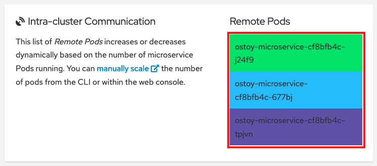
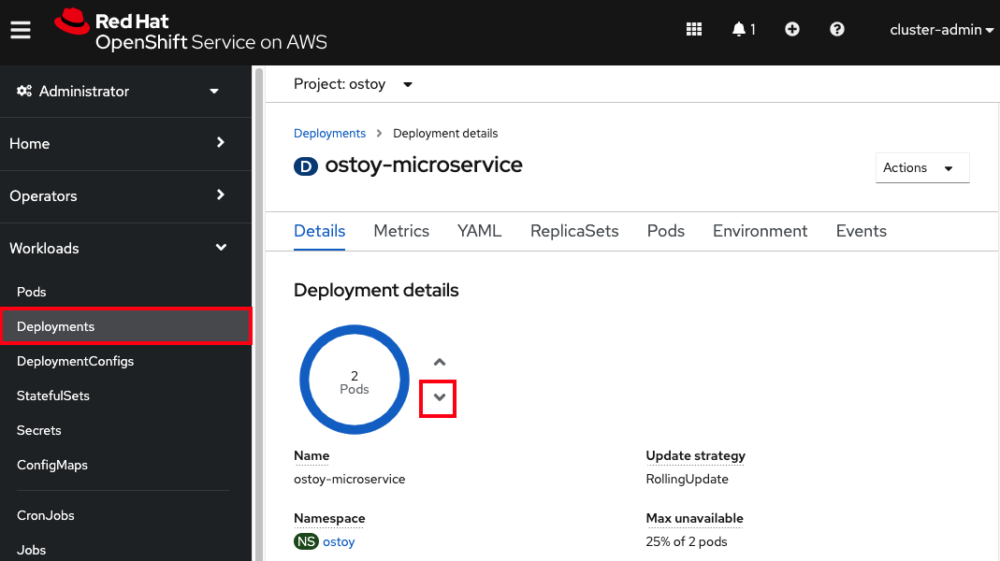
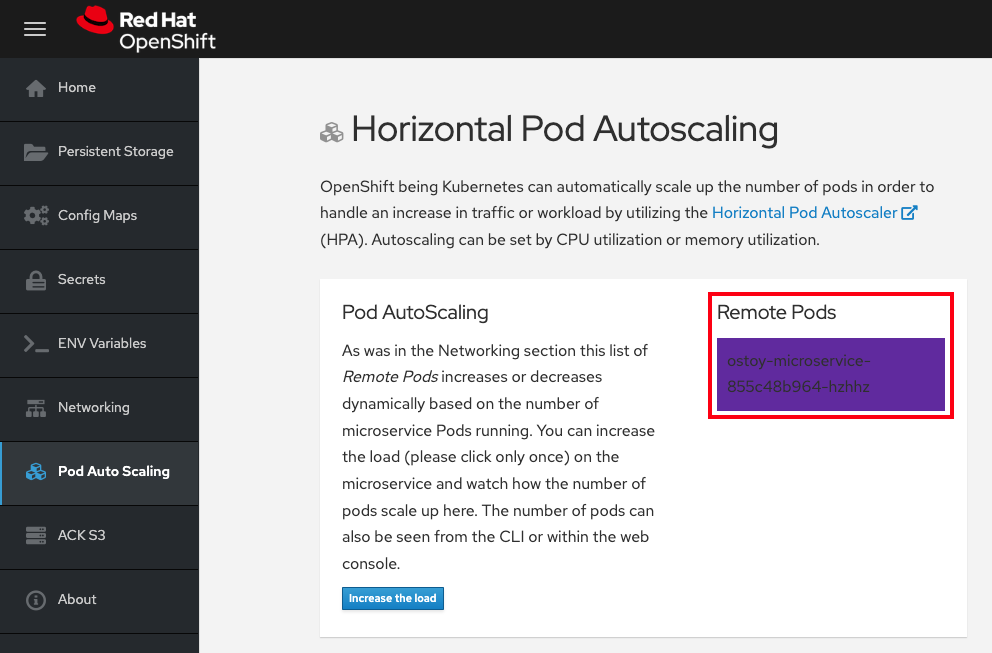

## Scaling

Scaling can refer to a few things.

1. Manually scaling pods
1. Pod autoscaling (Horizontal Pod Autoscaler)
1. Node autoscaling

We will explore all three.

### Pod scaling

OpenShift allows one to scale up/down the number of pods for each part of an application as needed.  This can be accomplished via changing our *replicaset/deployment* definition (declarative), by the command line (imperative), or via the web console (imperative). In our *deployment* definition (part of our `ostoy-fe-deployment.yaml`) we stated that we only want one pod for our microservice to start with. This means that the Kubernetes Replication Controller will always strive to keep one pod alive. We can also define pod autoscaling using the [Horizontal Pod Autoscaler](https://docs.openshift.com/container-platform/latest/nodes/pods/nodes-pods-autoscaling.html)(HPA) based on load to expand past what we defined if needed which we will do in a later section of this lab.

If we look at the tile on the left we should see one box randomly changing colors. This box displays the randomly generated color sent to the frontend by our microservice along with the pod name that sent it. Since we see only one box that means there is only one microservice pod.  We will now scale up our microservice pods and will see the number of boxes change.

#### 1. Confirm number of pods running
To confirm that we only have one pod running for our microservice, run the following command, or use the web console.

```
	$ oc get pods
	NAME                                   READY     STATUS    RESTARTS   AGE
	ostoy-frontend-679cb85695-5cn7x       1/1       Running   0          1h
	ostoy-microservice-86b4c6f559-p594d   1/1       Running   0          1h
```

#### 2. Scale pods via Deployment definition
Let's change our microservice definition yaml to reflect that we want 3 pods instead of the one we see. Download the [ostoy-microservice-deployment.yaml](https://raw.githubusercontent.com/openshift-cs/osdworkshop/master/OSD4/yaml/ostoy-microservice-deployment.yaml) and save it on your local machine, if you didn't do so already.

- Open the file using your favorite editor. Ex: `vi ostoy-microservice-deployment.yaml`
- Find the line that states `replicas: 1` and change that to `replicas: 3`. Then save and quit.

It will look like this:

```
	spec:
	    selector:
	      matchLabels:
	        app: ostoy-microservice
	    replicas: 3
```
- Assuming you are still logged in via the CLI, execute the following command:

		oc apply -f ostoy-microservice-deployment.yaml

>NOTE: You could also change it directly in the OpenShift Web Console by going to Deployments > "ostoy-microservice" > "YAML" tab.

- Confirm that there are now 3 pods via the CLI (`oc get pods`) or the web console (*Workloads > Deployments > ostoy-microservice*).
- See this visually by visiting the OSToy app > Networking in the left menu and counting how many boxes there are now.  It should be three.



#### 3. Scale down via CLI
Now we will scale the pods down using the command line.  

- Execute the following command from the CLI:

		oc scale deployment ostoy-microservice --replicas=2

- Confirm that there are indeed 2 pods, via the CLI or the web console.

		oc get pods

- See this visually by visiting the OSToy app and counting how many boxes there are now.  It should be two.

#### 4. Scale down via web console
Lastly, let's use the web console to scale back down to one pod.  

- In the project you created for this app (ex: "ostoy") in the left menu click *Workloads > Deployments > ostoy-microservice*.  On the left you will see a blue circle with the number 2 in the middle.
- Click on the down arrow to the right of that to scale the number of pods down to 1.

	

- See this visually by visiting the OSToy app and counting how many boxes there are now.  It should be one.
- You can also confirm this via the CLI or the web console.


### Pod Autoscaling

In this section we will explore how the [Horizontal Pod Autoscaler](https://docs.openshift.com/container-platform/latest/nodes/pods/nodes-pods-autoscaling.html) (HPA) can be used and works within Kubernetes/OpenShift. See here for [cluster autoscaling](/rosa/8-autoscaling) in ROSA.

As defined in the documentation:
> [...] you can use a horizontal pod autoscaler (HPA) to specify how OpenShift Container Platform should automatically increase or decrease the scale of a replication controller or deployment configuration, based on metrics collected from the pods that belong to that replication controller or deployment configuration.

In more simple words, "if there is a lot of work, make more pods".

We will create an HPA and then use OSToy to generate CPU intensive workloads.  We will then observe how the HPA will scale up the number of pods in order to handle the increased workloads.  

#### 1. Create the Horizontal Pod Autoscaler

Run the following command to create the autoscaler. This will create an HPA that maintains between 1 and 10 replicas of the Pods controlled by the *ostoy-microservice* Deployment created. Roughly speaking, the HPA will increase and decrease the number of replicas (via the deployment) to maintain an average CPU utilization across all pods of 80% (since each pod requests 50 millicores, this means average CPU usage of 40 millicores).

	oc autoscale deployment/ostoy-microservice --cpu-percent=80 --min=1 --max=10

#### 2. View the current number of pods

In the OSToy app in the left menu click on "Autoscaling" to access this portion of the workshop.  


As was in the networking section you will see the total number of pods available for the microservice by counting the number of colored boxes.  In this case we have only one.  This can be verified through the web console or from the CLI.

You can use the following command to see the running microservice pods only:

	oc get pods --field-selector=status.phase=Running | grep microservice

or visually in our application:



#### 3. Increase the load

Now that we know that we only have one pod let's increase the workload that the pod needs to perform. Click the link in the center of the card that says "increase the load".  **Please click only *ONCE*!**

This will generate some CPU intensive calculations.  (If you are curious about what it is doing you can click [here](https://github.com/openshift-cs/ostoy/blob/master/microservice/app.js#L32)).

> **Note:** The page may become slightly unresponsive.  This is normal; so be patient while the new pods spin up.

#### 4. See the pods scale up

After about a minute the new pods will show up on the page (represented by the colored rectangles). Confirm that the pods did indeed scale up through the OpenShift Web Console or the CLI (you can use the command above).

> **Note:** The page may still lag a bit which is normal.

#### 5. Review metrics with observability

In the OpenShift web console left menu, click on *Observe > Dashboards*

In the dashboard, select *Kubernetes / Compute Resources / Namespace (Pods)* and our namespace *ostoy*.


Wait a few minutes and colorful graphs will appear showing resource usage across CPU and memory. The top graph will show recent CPU consumption per pod and the lower graph will indicate memory usage. Looking at this graph you can see how things developed. As soon as the load started to increase (A), two new pods started to spin up (B, C). The thickness of each graph is its CPU consumption indicating which pods handled more load. We also see that the load decreased (D), after which, the pods were spun back down.


### Node Autoscaling

In ROSA one can also define [node autoscaling](https://docs.openshift.com/rosa/rosa_cluster_admin/rosa_nodes/rosa-nodes-about-autoscaling-nodes.html).  You can also visit the [Node Autoscaling](/rosa/8-autoscaling) section of this workshop for more information.

Before proceeding in this section please ensure that at least one machine pool has [autoscaling enabled](/rosa/8-autoscaling/#setting-up-cluster-autoscaling) otherwise this will not work.

#### 1. Enable Autoscaling nodes on the machine pool

If you have not already enabled autoscaling on a machine pool the please see the [Setting up cluster autoscaling](/rosa/8-autoscaling/#setting-up-cluster-autoscaling) section and follow the steps there to either enable autoscaling on an existing machine pool or create a new one with autoscaling enabled.

#### 2. Test the Cluster Autoscaler

Create a new project where we will define a job with a load that this cluster cannot handle. This should force the cluster to automatically create new nodes to handle the load.

Create a new project called "autoscale-ex":

	oc new-project autoscale-ex

Create the job

	oc create -f https://raw.githubusercontent.com/openshift/training/master/assets/job-work-queue.yaml

After a few seconds, run the following to see what pods have been created.


	$ oc get pods
	NAME                     READY   STATUS    RESTARTS   AGE
	work-queue-5x2nq-24xxn   0/1     Pending   0          10s
	work-queue-5x2nq-57zpt   0/1     Pending   0          10s
	work-queue-5x2nq-58bvs   0/1     Pending   0          10s
	work-queue-5x2nq-6c5tl   1/1     Running   0          10s
	work-queue-5x2nq-7b84p   0/1     Pending   0          10s
	work-queue-5x2nq-7hktm   0/1     Pending   0          10s
	work-queue-5x2nq-7md52   0/1     Pending   0          10s
	work-queue-5x2nq-7qgmp   0/1     Pending   0          10s
	work-queue-5x2nq-8279r   0/1     Pending   0          10s
	work-queue-5x2nq-8rkj2   0/1     Pending   0          10s
	work-queue-5x2nq-96cdl   0/1     Pending   0          10s
	work-queue-5x2nq-96tfr   0/1     Pending   0          10s


We see a lot of pods in a pending state.  This should trigger the autoscaler to create more nodes in our machine pool.

After a few minutes let's check how many worker nodes we have.

	$ oc get nodes
	NAME                                         STATUS   ROLES          AGE     VERSION
	ip-10-0-138-106.us-west-2.compute.internal   Ready    infra,worker   22h     v1.23.5+3afdacb
	ip-10-0-153-68.us-west-2.compute.internal    Ready    worker         2m12s   v1.23.5+3afdacb
	ip-10-0-165-183.us-west-2.compute.internal   Ready    worker         2m8s    v1.23.5+3afdacb
	ip-10-0-176-123.us-west-2.compute.internal   Ready    infra,worker   22h     v1.23.5+3afdacb
	ip-10-0-195-210.us-west-2.compute.internal   Ready    master         23h     v1.23.5+3afdacb
	ip-10-0-196-84.us-west-2.compute.internal    Ready    master         23h     v1.23.5+3afdacb
	ip-10-0-203-104.us-west-2.compute.internal   Ready    worker         2m6s    v1.23.5+3afdacb
	ip-10-0-217-202.us-west-2.compute.internal   Ready    master         23h     v1.23.5+3afdacb
	ip-10-0-225-141.us-west-2.compute.internal   Ready    worker         23h     v1.23.5+3afdacb
	ip-10-0-231-245.us-west-2.compute.internal   Ready    worker         2m11s   v1.23.5+3afdacb
	ip-10-0-245-27.us-west-2.compute.internal    Ready    worker         2m8s    v1.23.5+3afdacb
	ip-10-0-245-7.us-west-2.compute.internal     Ready    worker         23h     v1.23.5+3afdacb

We can see that more worker nodes were automatically created to handle the workload.  
