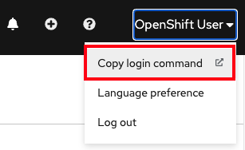
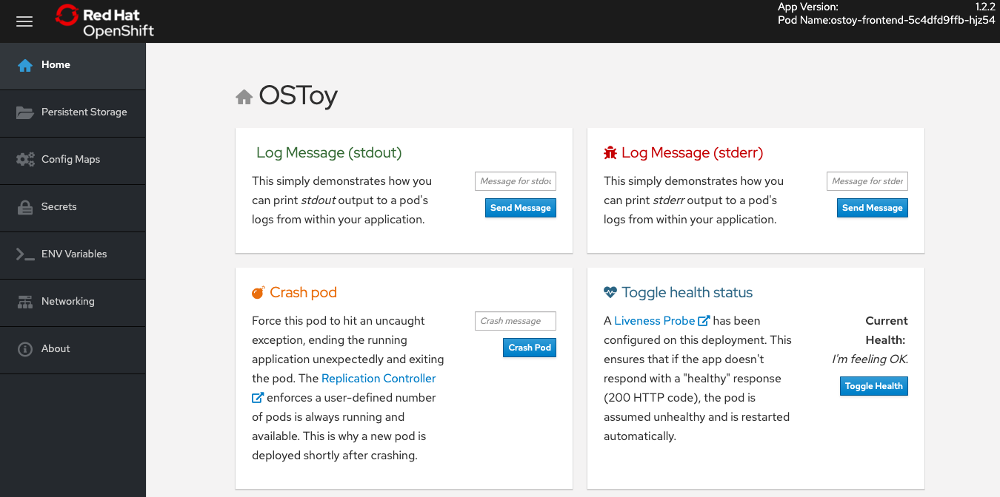

## Deploy via a Kubernetes Deployment
One way to deploy the application would be to have the images for the front-end and back-end microservice containers already created (via CI/CD) and stored in an image repository.  You can then create Kubernetes deployments (YAML) and use those to deploy the application.  We will do that now.

### Retrieve the login command
If you are not logged in via the CLI, [access your cluster via the web console](/rosa/6-access_cluster/#accessing-the-cluster-via-the-web-console), then click on the dropdown arrow next to your name in the top-right and select *Copy Login Command*.



A new tab will open and select the authentication method you are using.

Click *Display Token*

Copy the command under where it says "Log in with this token". Then go to your terminal and paste that command and press enter.  You will see a similar confirmation message if you successfully logged in.

```
$ oc login --token=RYhFlXXXXXXXXXXXX --server=https://api.osd4-demo.abc1.p1.openshiftapps.com:6443
Logged into "https://api.myrosacluster.abcd.p1.openshiftapps.com:6443" as "0kashi" using the token provided.

You don't have any projects. You can try to create a new project, by running

oc new-project <projectname>
```

### Create new project
Create a new project called "ostoy" in your cluster by entering the following command:

```
oc new-project ostoy
```

You should receive the following response:

```
$ oc new-project ostoy
Now using project "ostoy" on server "https://api.myrosacluster.abcd.p1.openshiftapps.com:6443".
[...]
```

!!! note
    If you need a unique project name you can run:

    ```
    oc new-project ostoy-$(uuidgen | cut -d - -f 2 | tr '[:upper:]' '[:lower:]')
    ```

Equivalently you can also create this new project using the [web console UI](/rosa/6-access_cluster/#accessing-the-cluster-via-the-web-console) by clicking on "Projects" under "Home" on the left menu, and then click "Create Project" button on the right.


### Deploy the backend microservice
The microservice serves internal web requests and returns a JSON object containing the current hostname and a randomly generated color string.

In your terminal deploy the microservice using the following command:

```
oc apply -f https://raw.githubusercontent.com/openshift-cs/rosaworkshop/master/rosa-workshop/ostoy/yaml/ostoy-microservice-deployment.yaml
```

You should see the following response:

```
$ oc apply -f https://raw.githubusercontent.com/openshift-cs/rosaworkshop/master/rosa-workshop/ostoy/yaml/ostoy-microservice-deployment.yaml
deployment.apps/ostoy-microservice created
service/ostoy-microservice-svc created
```

### Deploy the front-end service
The frontend deployment contains the node.js frontend for our application along with a few other Kubernetes objects.

 If you open the *ostoy-frontend-deployment.yaml* you will see we are defining:

- Persistent Volume Claim
- Deployment Object
- Service
- Route
- Configmaps
- Secrets

In your terminal, deploy the frontend along with creating all objects mentioned above by entering:

```
oc apply -f https://raw.githubusercontent.com/openshift-cs/rosaworkshop/master/rosa-workshop/ostoy/yaml/ostoy-frontend-deployment.yaml
```

You should see all objects created successfully

```
$ oc apply -f https://raw.githubusercontent.com/openshift-cs/rosaworkshop/master/rosa-workshop/ostoy/yaml/ostoy-frontend-deployment.yaml
persistentvolumeclaim/ostoy-pvc created
deployment.apps/ostoy-frontend created
service/ostoy-frontend-svc created
route.route.openshift.io/ostoy-route created
configmap/ostoy-configmap-env created
secret/ostoy-secret-env created
configmap/ostoy-configmap-files created
secret/ostoy-secret created
```

### Get the route
Get the route so that we can access the application.

```
oc get route
```

You should see the following response:

```
NAME          HOST/PORT                                                 PATH   SERVICES             PORT    TERMINATION   WILDCARD
ostoy-route   ostoy-route-ostoy.apps.my-rosa-cluster.g14t.p1.openshiftapps.com          ostoy-frontend-svc   <all>                 None
```

### View the app
Copy `ostoy-route-ostoy.apps.myrosacluster.abcd.p1.openshiftapps.com` above and paste it into your browser and press enter. You should see the homepage of our application. If the page does not come up make sure that it is using `http` and **not** `https`.


