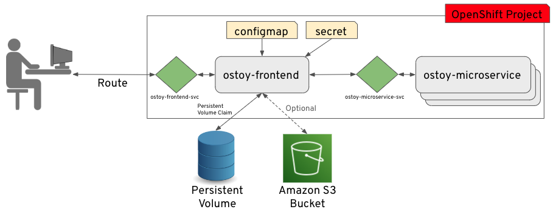
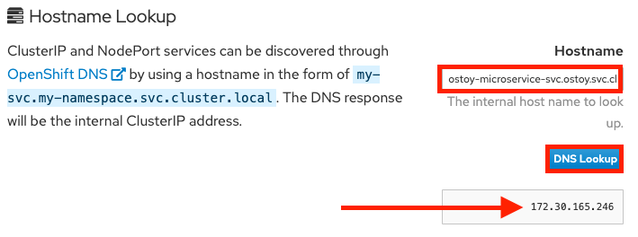

## Networking
In this section we'll see how OSToy uses intra-cluster networking to separate functions by using microservices and visualize the scaling of pods.

Let's review how this application is set up...

As can be seen in the image above, we have defined at least 2 separate pods, each with its own service.  One is the frontend web application (with a service and a publicly accessible route) and the other is the backend microservice with a service object so that the frontend pod can communicate with the microservice (across the pods if more than one).  Therefore this microservice is not accessible from outside this cluster, or from other namespaces/projects if configured (due to OpenShift's network policy, [ovs-networkpolicy](https://docs.openshift.com/container-platform/latest/networking/network_policy/about-network-policy.html)).  The sole purpose of this microservice is to serve internal web requests and return a JSON object containing the current hostname (which is the podname) and a randomly generated color string.  This color string is used to display a box with that color displayed in the tile titled "Intra-cluster Communication".

### Networking

#### 1. Intra-cluster networking
Click on *Networking* in the left menu. Review the networking configuration. The right tile titled "Hostname Lookup" illustrates how the service name created for a pod can be used to translate into an internal ClusterIP address.

#### 2. Lookup internal IP address of the service
Enter the name of the microservice we created in the right tile ("Hostname Lookup") following the format of `my-svc.my-namespace.svc.cluster.local` which we created in the service definition of `ostoy-microservice.yaml` which can be seen here:

    apiVersion: v1
    kind: Service
    metadata:
      name: ostoy-microservice-svc
      labels:
        app: ostoy-microservice
    spec:
      type: ClusterIP
      ports:
        - port: 8080
          targetPort: 8080
          protocol: TCP
      selector:
        app: ostoy-microservice

In this case we will enter: `ostoy-microservice-svc.ostoy.svc.cluster.local`

#### 3. IP address returned
We will see an IP address returned. In our example it is `172.30.165.246`.  This is the intra-cluster IP address; only accessible from within the cluster.

