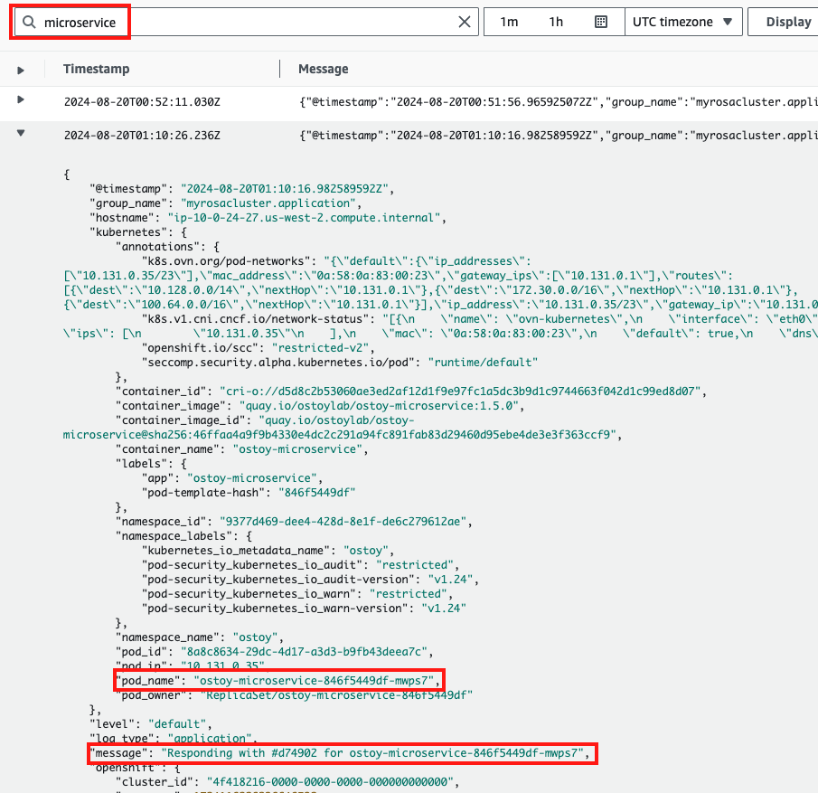
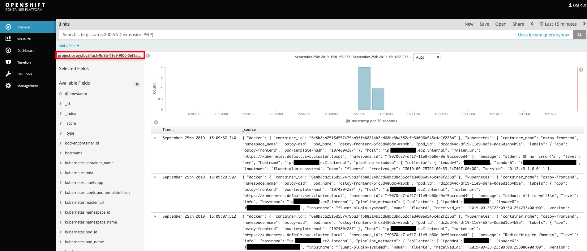
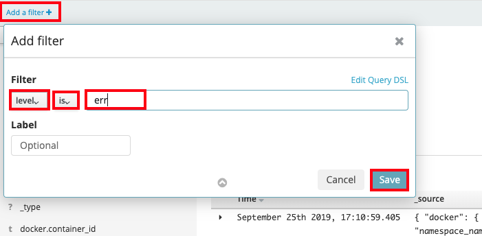

## Logging
We will take a look at the available options for logging in ROSA. <!-- As ROSA does not come preconfigured with a logging solution, we can easily set one up. In this section review the [install proceedure](https://docs.openshift.com/dedicated/4/logging/dedicated-cluster-deploying.html#dedicated-cluster-install-deploy) for the EFK (Elasticsearch, Fluentd and Kibana) stack (via Operators), then we will take a look at three methods with which one can view their logs. -->

1. We will look at the logs directly through the pod using `oc logs`.  
1. We will forward the logs to AWS CloudWatch and view them from there.
1. We will use Kibana (EFK Stack) to search our logs.

The cluster logging components are based upon Fluentd, (and Elasticsearch and Kibana, if deployed). The collector, Fluentd, is deployed to each node in the cluster. It collects application logs and writes them to Elasticsearch (ES) or forwards it to CloudWatch. Kibana is the centralized, web UI where users and administrators can create rich visualizations and dashboards with the aggregated data. We will also look at using AWS CloudWatch as well.

* Learn more about [logging](https://docs.openshift.com/rosa/logging/cluster-logging.html).

### Configure forwarding to AWS CloudWatch
<!--
!!! danger
	If you plan on running EFK <u>do not follow</u> the installation steps in this section but rather follow the [Installing OpenShift Logging](https://docs.openshift.com/container-platform/latest/logging/cluster-logging-deploying.html) steps and skip down to [View logs with Kibana](#view-logs-with-kibana).

In the following steps we will install the logging add-on service to forward our logs; in our case to AWS CloudWatch. If you did not follow the "Getting Started" guide of this workshop and **did not** install ROSA with STS, then you can skip to install the service though the OCM UI or by using the CLI (in step 8). Otherwise, there are a few steps we need to do first in order to get this to work for ROSA with STS. -->

!!! note
	These steps were adopted from our Managed OpenShift Black Belts [here](https://mobb.ninja/docs/rosa/clf-cloudwatch-sts/).

Configuring ROSA to send logs to CloudWatch is not covered in this lab, as it goes beyond the lab's scope. However, integrating with AWS and enabling CloudWatch logging is an important aspect of ROSA's integration with AWS, so a script has been included to simplify the configuration process. The script will automatically set up AWS CloudWatch. If you're interested, you can examine the script to understand the steps involved.

1. Run the following script to configure your ROSA cluster to forward logs to CloudWatch.

	```
	curl https://raw.githubusercontent.com/openshift-cs/rosaworkshop/master/rosa-workshop/ostoy/resources/configure-cloudwatch.sh | bash
	```

	Sample Output:

	```
	deployment "cluster-logging-operator" successfully rolled out
	secret/cloudwatch-credentials created
	clusterlogforwarder.logging.openshift.io/instance created
	clusterlogging.logging.openshift.io/instance created
	```
1. After a few minutes, you should begin to see log groups inside of AWS CloudWatch. Repeat this command until you do or continue the lab if you don't want to wait.

	```
	aws logs describe-log-groups --log-group-name-prefix rosa-${GUID}
	```

	Sample Output:

	```
	{
		"logGroups": [
			{
				"logGroupName": "rosa-fxxj9.audit",
				"creationTime": 1682098364311,
				"metricFilterCount": 0,
				"arn": "arn:aws:logs:us-east-2:511846242393:log-group:rosa-fxxj9.audit:*",
				"storedBytes": 0
			},
			{
				"logGroupName": "rosa-fxxj9.infrastructure",
				"creationTime": 1682098364399,
				"metricFilterCount": 0,
				"arn": "arn:aws:logs:us-east-2:511846242393:log-group:rosa-fxxj9.infrastructure:*",
				"storedBytes": 0
			}
		]
	}
	```

### Output data to the streams/logs

1. Output a message to *stdout*
Click on the *Home* menu item and then click in the message box for "Log Message (stdout)" and write any message you want to output to the *stdout* stream.  You can try "**All is well!**".  Then click "Send Message".

	

2. Output a message to *stderr*
Click in the message box for "Log Message (stderr)" and write any message you want to output to the *stderr* stream. You can try "**Oh no! Error!**".  Then click "Send Message".

	

### View application logs using `oc`

1. Go to the CLI and enter the following command to retrieve the name of your frontend pod which we will use to view the pod logs:

	```
	$ oc get pods -o name
	pod/ostoy-frontend-679cb85695-5cn7x
	pod/ostoy-microservice-86b4c6f559-p594d
	```

So the pod name in this case is **ostoy-frontend-679cb85695-5cn7x**.  

1. Run `oc logs ostoy-frontend-679cb85695-5cn7x` and you should see your messages:

	```
	$ oc logs ostoy-frontend-679cb85695-5cn7x
	[...]
	ostoy-frontend-679cb85695-5cn7x: server starting on port 8080
	Redirecting to /home
	stdout: All is well!
	stderr: Oh no! Error!
	```

You should see both the *stdout* and *stderr* messages.


### View logs with CloudWatch
1. Access the web console for your AWS account and go to CloudWatch.
1. Click on *Logs* > *Log groups* in the left menu to see the different groups of logs depending on what you selected during installation. If you followed the previous steps you should see 2 groups.  One for `<cluster-name>-XXXXX-application` and one for `<cluster-name>-XXXXX-infrastructure`.

	

1. Click on `<cluster-name>-XXXXX.application`
1. Click on the log stream for the "frontend" pod.  It will be titled something like `kubernetes.var[...]ostoy-frontend-[...]`

	

1. Filter for "stdout" and "stderr" the expand the row to show the message we had entered earlier along with much other information.

	


1. We can also see other messages in our logs from the app. Enter "microservice" in the search bar, and expand one of the entries. This shows us the color received from the microservice and which pod sent that color to our frontend pod.

	


You can also use some of the other features of CloudWatch to obtain useful information. But [how to use CloudWatch](https://docs.aws.amazon.com/AmazonCloudWatch/latest/monitoring/WhatIsCloudWatch.html) is beyond the scope of this tutorial.

### View logs with Kibana
!!! note
 		In order to use EFK, this section assumes that you have successfully completed the steps outlined in [Installing OpenShift Logging](https://docs.openshift.com/container-platform/latest/logging/cluster-logging-deploying.html).

1. Run the following command to get the route for the Kibana console:

		oc get route -n openshift-logging

1. Open up a new browser tab and paste the URL. You will first have to define index patterns.  Please see the [Defining Kibana index patterns](https://docs.openshift.com/container-platform/latest/logging/cluster-logging-deploying.html#cluster-logging-visualizer-indices_cluster-logging-deploying) section of the documentation for further instructions on doing so.

	<!---->

#### Familiarization with the data
In the main part of the console you should see three entries. These will contain what we saw in the above section (viewing through the pods).  You will see the *stdout* and *stderr* messages that we inputted earlier (though you may not see it right away as we might have to filter for it).  In addition to the log output you will see information about each entry.  You can see things like:

- namespace name
- pod name
- host ip address
- timestamp
- log level
- message


You will also see that there is data from multiple sources and multiple messages.  If we expand one of the twisty-ties we can see further details


#### Filtering Results
Let's look for any errors encountered in our app.  Since we have many log entries (most from the previous networking section) we may need to filter to make it easier to find the errors.  To find the error message we outputted to *stderr* lets create a filter.  

- Click on "Add a filter+" under the search bar on the upper left.
- For "Fields..." select (or type) "level"
- For "Operators" select "is"
- In "Value..." type in "err"
- Click "Save"



You should see now only one row is returned that contains our error message.


!!! note
	If nothing is returned, depending on how much time has elapsed since you've outputted the messages to the *stdout* and *stderr* streams you may need to set the proper time frame for the filter.  If you are following this lab consistently then the default should be fine.  Otherwise, in the Kibana console, click on the top right where it should say "Last 15 minutes" and click on "Quick" then "Last 1 hour" (though adjust to your situation as needed).
