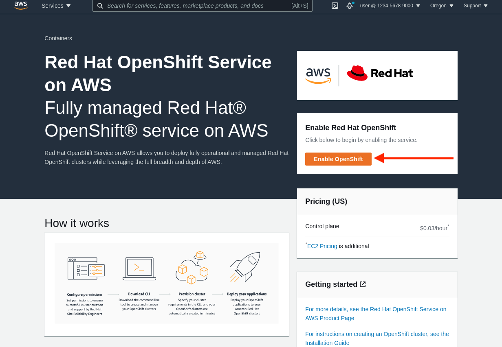
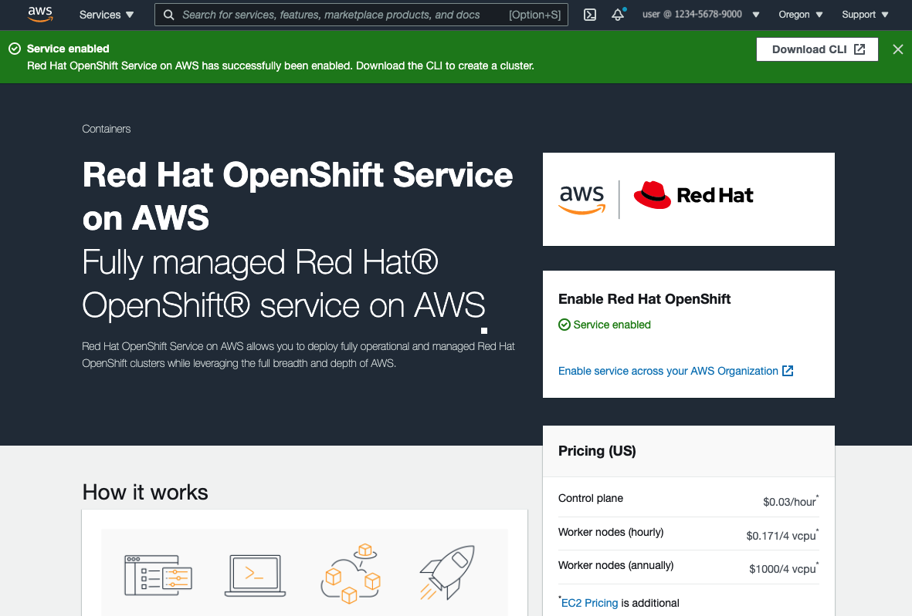
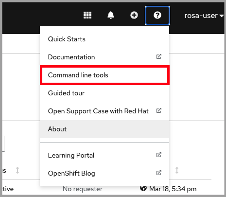
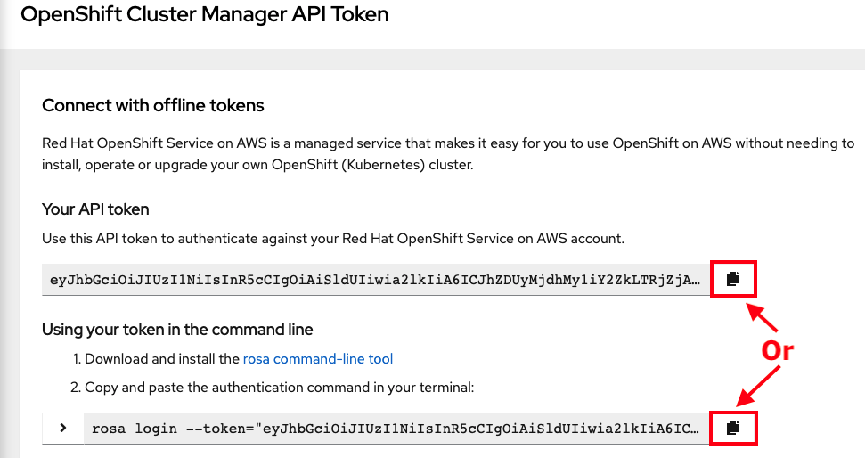

There are currently two supported credential methods when creating a ROSA cluster. One method uses an IAM user with the *AdministratorAccess* policy (only for the account using ROSA). The other, more recent, and **recommended** method uses AWS STS. Please see the section "[ROSA with STS Explained](15-sts_explained.md)" for a detailed explanation. In this workshop we will only be using the STS method.

## Prerequisites

Please review the prerequisites found in the documentation at [Prerequisites for ROSA w/STS](https://docs.openshift.com/rosa/rosa_getting_started_sts/rosa-sts-aws-prereqs.html) before getting started.

You will need the following pieces of information from your AWS account:

- AWS IAM User
- AWS Access Key ID
- AWS Secret Access Key

### A Red Hat account
If you do not have a Red Hat account, create one here <https://console.redhat.com/>. Accept the required terms and conditions. Then check your email for a verification link.

### Install the AWS CLI
[Install the AWS CLI](https://aws.amazon.com/cli/) as per your operating system.

### Enable ROSA
Complete this step if you have *not* enabled ROSA in your AWS account.

- Visit <https://console.aws.amazon.com/rosa> to enable your account to use ROSA.
- Click on the orange "Enable OpenShift" button on the right.

    

- It will take about a minute and then you will see a green "service enabled" bar at the top.

    

### Install the ROSA CLI
- Install the [ROSA CLI](https://console.redhat.com/openshift/downloads) as per your operating system.
- Download and extract the relevant file for your operating system
    - ex: `tar -xvf rosa-linux.tar.gz`
- Save it to a location within your "PATH".
    - ex: `sudo mv rosa /usr/local/bin/rosa`
- Run `rosa version` to make sure it works and that it returns the version number.

### Install the OpenShift CLI
There are a few ways to install the `oc` CLI:

1. If you have the `rosa` CLI installed, the simplest way is to run `rosa download oc`
    1. Once downloaded, untar (or unzip) the file and move the executables into a directory in your PATH
1. Or, you can [download and install](https://docs.openshift.com/container-platform/4.9/cli_reference/openshift_cli/getting-started-cli.html#installing-openshift-cli) the latest OpenShift CLI (oc)  
1. Or, if you already have an OpenShift cluster you can access the command line tools page by clicking on the *Question mark > Command Line Tools*.  Then download the relevant one for your operating system.

  

**Why use `oc` over `kubectl`** 
Being Kubernetes, one can definitely use `kubectl` with their OpenShift cluster.  `oc` is specific to OpenShift in that it includes the standard set of features from `kubectl` plus additional support for OpenShift functionality.  See [Usage of oc and kubectl commands](https://docs.openshift.com/container-platform/4.9/cli_reference/openshift_cli/usage-oc-kubectl.html) for more details.

### Configure the AWS CLI
If you've just installed the AWS CLI, or simply want to make sure it is using the correct AWS account, follow these steps in a terminal:

>**NOTE:** You must use an actual IAM and not an assumed role

1. Enter `aws configure` in the terminal
2. Enter the AWS Access Key ID and press enter
3. Enter the AWS Secret Access Key and press enter
4. Enter the default region you want to deploy into
5. Enter the output format you want (“table” or “json”).  For this guide you can choose “table” as it is easier to read but either is fine.

    It should look like the following as an example:

        $ aws configure
        AWS Access Key ID: AKIA0000000000000000
        AWS Secret Access Key: NGvmP0000000000000000000000000
        Default region name: us-east-1
        Default output format: table

### Verify the configuration
Verify that the configuration is correct.

1. Run the following command to query the AWS API      

        aws sts get-caller-identity

2. You should see a table (or JSON if that’s what you set it to above) like the below.  Verify that the account information is correct.

        $ aws sts get-caller-identity
        ------------------------------------------------------------------------------
        |                                GetCallerIdentity                           |
        +--------------+----------------------------------------+--------------------+
        |    Account   |                   Arn                  |        UserId      |
        +--------------+----------------------------------------+--------------------+
        |  000000000000|  arn:aws:iam::00000000000:user/myuser  |  AIDA00000000000000|
        +--------------+----------------------------------------+--------------------+

### Ensure the ELB service role exists
Make sure that the service role for ELB already exists, otherwise the cluster deployment could fail. As such, run the following to check for the role and create it if it is missing.

    aws iam get-role --role-name "AWSServiceRoleForElasticLoadBalancing" || aws iam create-service-linked-role --aws-service-name "elasticloadbalancing.amazonaws.com"

If you received an error during cluster creation like below, then the above should correct it.

    Error: Error creating network Load Balancer: AccessDenied: User: arn:aws:sts::970xxxxxxxxx:assumed-role/ManagedOpenShift-Installer-Role/163xxxxxxxxxxxxxxxx is not authorized to perform: iam:CreateServiceLinkedRole on resource: arn:aws:iam::970xxxxxxxxx:role/aws-service-role/elasticloadbalancing.amazonaws.com/AWSServiceRoleForElasticLoadBalancing"

### Log into your Red Hat account
1. Enter `rosa login` in a terminal.
2. It will prompt you to open a web browser and go to:

    <https://console.redhat.com/openshift/token/rosa>

3. If you are asked to log in, then please do.
4. Click on the "Load token" button.
5. Copy the token and paste it back into the CLI prompt and press enter.  Alternatively, you can just copy the full `rosa login --token=abc...` command and paste that in the terminal.

    

### Verify credentials
Verify that all the credentials set up are correctly.

1. Run `rosa whoami`

    You should see an output like below:

        AWS Account ID:               000000000000
        AWS Default Region:           us-east-2
        AWS ARN:                      arn:aws:iam::000000000000:user/myuser
        OCM API:                      https://api.openshift.com
        OCM Account ID:               1DzGIdIhqEWy000000000000000
        OCM Account Name:             Your Name
        OCM Account Username:         you@domain.com
        OCM Account Email:            you@domain.com
        OCM Organization ID:          1HopHfA20000000000000000000
        OCM Organization Name:        Red Hat
        OCM Organization External ID: 0000000

2. Please check all information for accuracy before proceeding.

### Verify quota
Verify that your AWS account has ample quota in the region you will be deploying your cluster to.  Run the following:

    rosa verify quota

Should return a response like

    I: Validating AWS quota...
    I: AWS quota ok. If cluster installation fails, validate actual AWS resource usage against https://docs.openshift.com/rosa/rosa_getting_started/rosa-required-aws-service-quotas.html

See [the documentation](https://docs.openshift.com/rosa/rosa_getting_started_sts/rosa-sts-required-aws-service-quotas.html) for more details regarding quotas.

### Verify `oc` CLI
Verify that the `oc` CLI is installed correctly

    rosa verify openshift-client

<!--## Verify quota, permissions and initialize your AWS account
This step runs a CloudFormation template that prepares your AWS account for cluster deployment and management. This step typically takes 1-2 minutes to complete. This step also will verify that your account quota is adequate and permissions are accurate.

1. Run `rosa init` in your terminal window.  You will see a response like the below.  Make sure everything looks good and there are no errors.

        I: Logged in as 'you@domain.com' on 'https://api.openshift.com'
        I: Validating AWS credentials...
        I: AWS credentials are valid!
        I: Validating SCP policies...
        I: AWS SCP policies ok
        I: Validating AWS quota...
        I: AWS quota ok
        I: Ensuring cluster administrator user 'osdCcsAdmin'...
        I: Admin user 'osdCcsAdmin' created successfully!
        I: Validating SCP policies for 'osdCcsAdmin'...
        I: AWS SCP policies ok
        I: Validating cluster creation...
        I: Cluster creation valid
        I: Verifying whether OpenShift command-line tool is available...
        I: Current OpenShift Client Version: 4.6. -->

We have now successfully set up our account and environment and are ready to deploy our cluster in the next step.

*[ROSA]: Red Hat OpenShift Service on AWS
*[STS]: AWS Secure Token Service
