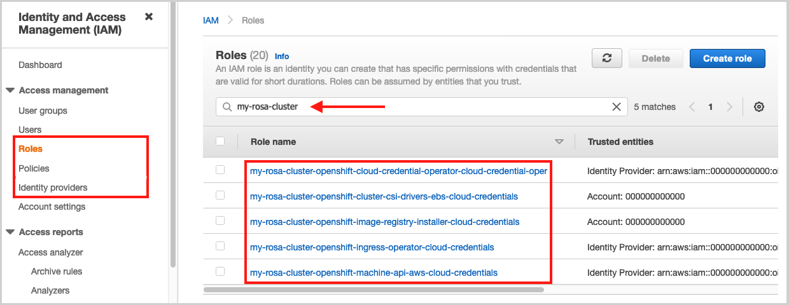

## Deleting a ROSA Cluster

To delete a ROSA cluster follow the steps below.

1. If you need to list your clusters in order to make sure you are deleting the correct one run

		rosa list clusters

1. Once you know which one to delete run

		rosa delete cluster --cluster=<clustername>

1. It will prompt you to confirm that you want to delete it. Press “y” then enter. The cluster will be deleted and all associated infrastructure. **THIS IS NON-RECOVERABLE.**

	Please note that all AWS STS/IAM roles and policies will remain.

1. Once complete, you may then remove all the cluster roles and policies via the `aws` CLI or from the AWS web console. These can be found uner IAM > Roles/Policies > search for "ManangedOpenShift", your specified prefix (if specified) or the cluster name.

	

1. The remaining roles would be account-scoped and should only be removed if they are <u>no longer needed by other clusters in the same account </u>. 

*[ROSA]: Red Hat OpenShift Service on AWS
*[IdP]: Identity Provider
*[OCM]: OpenShift Cluster Manager
*[STS]: AWS Secure Token Service