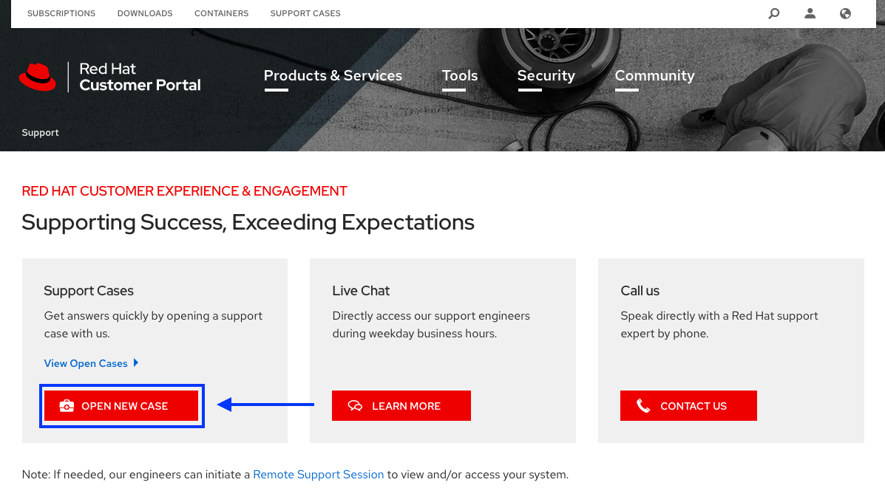
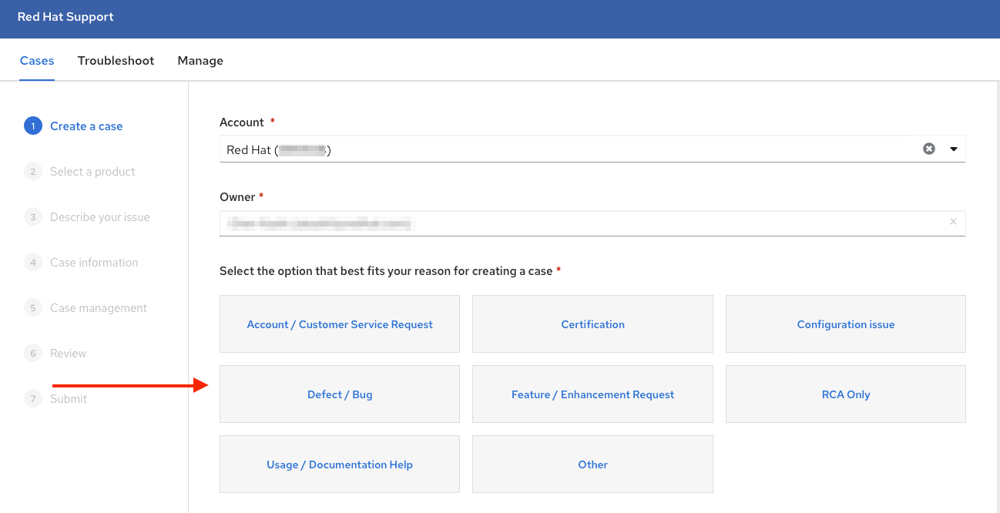
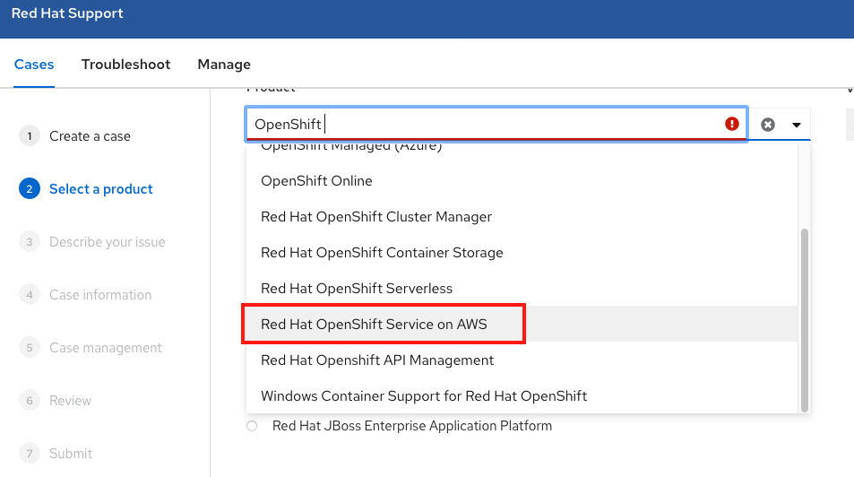
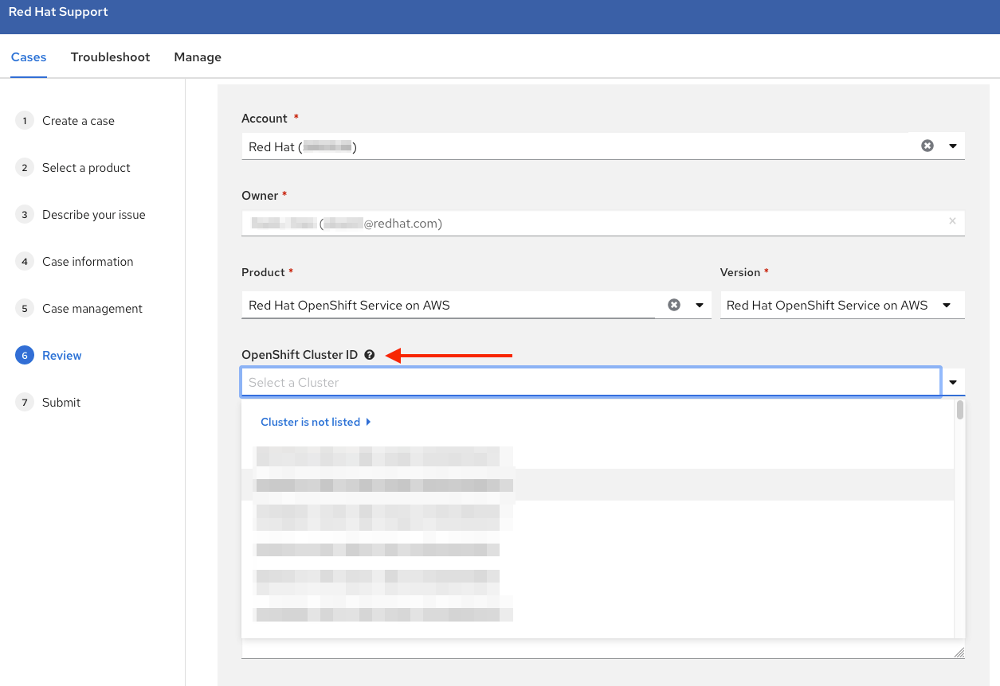

## Obtaining Support

Finding the right help when you need it is important.  So we will review the resources at your disposal for when you need some assistance.

- [ROSA Documentation](https://docs.openshift.com/rosa/welcome/index.html) (ROSA specific documentation)
    - [Policies and Definitions](https://docs.openshift.com/rosa/rosa_policy/rosa-service-definition.html)
    - [Responsibility Assignment Matrix](https://docs.openshift.com/rosa/rosa_policy/rosa-policy-responsibility-matrix.html)
    - [Understanding Process and Security](https://docs.openshift.com/rosa/rosa_policy/rosa-policy-process-security.html)
    - [About Availability](https://docs.openshift.com/rosa/rosa_policy/rosa-policy-understand-availability.html)
- [OpenShift Documentation](https://docs.openshift.com/container-platform/4.7/welcome/index.html) (for all OpenShift related information)
- [Blogs](https://www.openshift.com/blog)
- Contact Support - Reviewed in detail below

#### Contacting Red Hat for support

1. Go to <https://support.redhat.com>
1. Click on “Open a new Case” on the left-most box

    

1. If not signed in with your Red Hat account you will be asked for your login and password.  Please enter it.
1. Select the reason for contacting support

    

1. Select “Red Hat OpenShift Service on AWS” 

    

1. Click continue at the bottom
1. Enter a summary of the issue/reason for contacting support and write out the details of your request.  You can also upload any files/logs/screenshots that may help. The more details you provide the better.  Some suggestions may be given to you at the bottom that might help with your issue.

    

1. Click continue
1. Some more fields will now be visible and answer the corresponding questions.
1. Click continue
1. Enter the following information about your case
    1. **Support level:** Premium
    1. **Severity:** Review the Red Hat Support Severity Level Definitions to choose the correct one.
    1. **Group:** If this is related to a few other cases you can select the corresponding group
    1. **Language**
    1. **Send notifications:** Add colleagues’ email addresses who you want to keep notified of activity
    1. **Red Hat associates:**  If you are working with any from Red Hat and want to keep them in the loop you can enter their email addresses here. 
    1. **Alternate Case ID:** If you want to attach your own ID to it you can enter it here
1. Click Continue
1. On the review screen make sure you select the correct cluster ID that you are contacting support about.

    

1. Click submit at the bottom of the page.
1. You will be contacted based on the response time committed to for the severity level indicated.  You can see here for the response time Terms of Service (OpenShift Dedicated Column): <https://access.redhat.com/support/offerings/openshift/sla>

*[ROSA]: Red Hat OpenShift Service on AWS
*[IdP]: Identity Provider
*[OCM]: OpenShift Cluster Manager