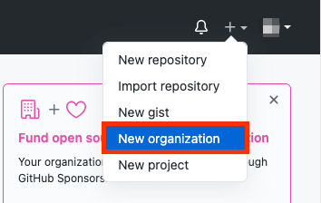
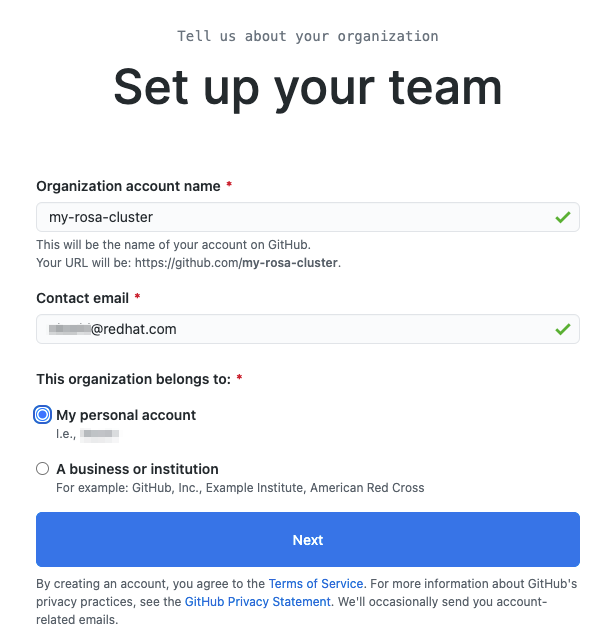
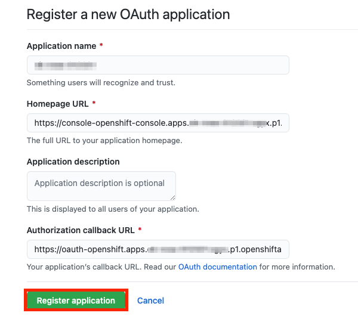
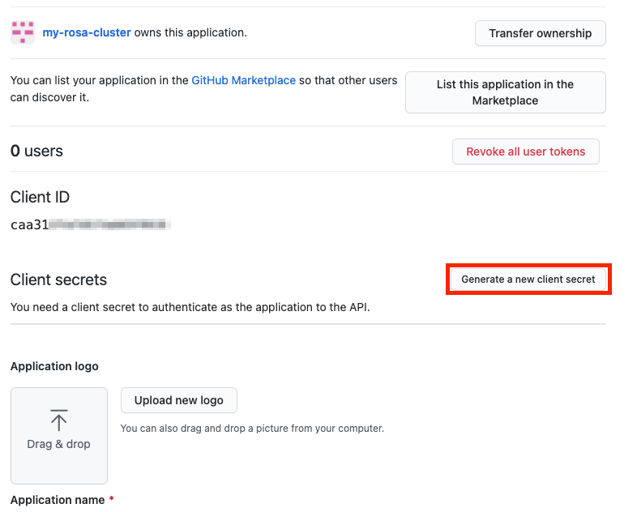
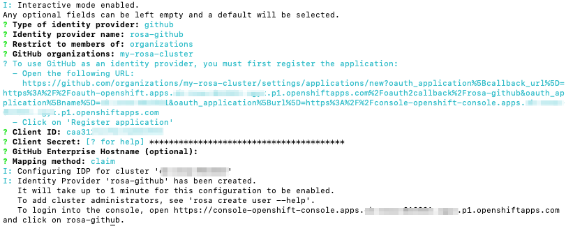
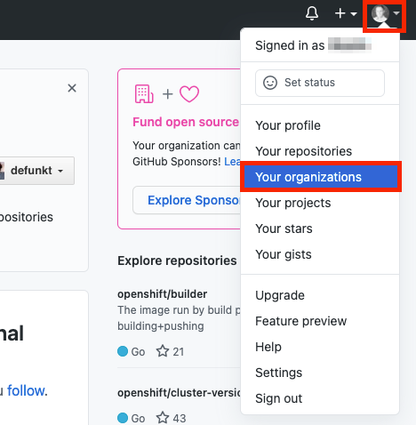
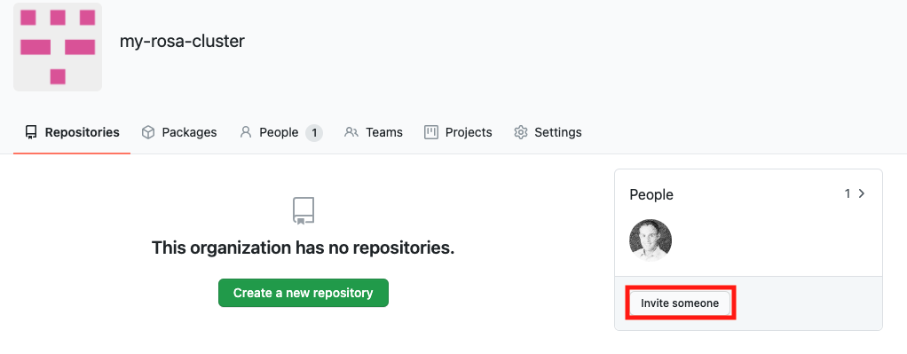

## Setting up an IdP with GitHub
To log in to your cluster, it is recommended to set up an identity provider (IdP). This procedure uses GitHub as an example IdP. See the full list of [supported IdPs](https://docs.openshift.com/rosa/rosa_getting_started/rosa-config-identity-providers.html#supported-identity-providers) by ROSA. 

> **NOTE:** To view all options run `rosa create idp --help`.

1. Log into your GitHub account
2. You can either use an existing Organization that you're an admin of, or create a new one. If you already have one that you want to use skip to step “7”. Here we will create a new Organization for use with our new ROSA cluster.  Click on the “+”  icon in the top then click on “New Organization”.

    

3. If you are asked to “Pick a plan for your team”, choose the most applicable to you, or just click “Join for free” on the bottom left.
4. Choose a name for the organization, an email, and whether it is personal or business.  Click Next.

    

5. If you have other users that you want to grant access to your ROSA cluster you can add their GitHub IDs to the organization or you can add them later. We will click “Complete Setup” without adding anyone else.
6. You can fill in the requested information on the following page or just click “Submit” at the bottom.
7. Go back to the terminal and enter the following command to set up the GitHub IdP.

        rosa create idp --cluster=<cluster name> --interactive

8. Enter the following values that are in bold below:
    
    * Type of identity provider: **github**
    * Identity Provider Name: **rosa-github** (Or this can be any name you choose)
    * Restrict to members of: **organizations**
    * GitHub organizations: **my-rosa-cluster** (or enter the name of your org)

9. The CLI will provide you with a link. Copy and paste that into a browser and press enter. This will pre fill the required information for you in order to register this application for OAuth. You don’t need to modify any of the information.

    

10. Click "Register application"

    

11. On the next page it will show you a “Client ID”.  Copy this and paste it back into the terminal where it asks for “Client ID”. **DO NOT CLOSE THIS TAB.**
12. The CLI now asks for a “Client Secret”.  So go back in your browser and click on “Generate a new client secret” near the middle of the page towards the right.

    

13. A secret will be generated for you. Make sure to copy it as it will never be visible again.
14. Paste it into the terminal where the CLI is asking for the Client Secret and press enter.
15. Leave "GitHub Enterprise Hostname" blank.
16. Select “claim” (For more details see [Identity provider parameters](https://docs.openshift.com/container-platform/4.7/post_installation_configuration/preparing-for-users.html#identity-provider-parameters_post-install-preparing-for-users))
17. Then the IdP will be created but can take up to 1 minute for the configuration to land onto your cluster.
    
    Your inputs should look similar to the following:

    

18. Copy and paste the link returned at the end into your browser and you should see the IdP we just set up available.  If you've followed this tutorial it is called “rosa-github”. You can click on this and use your GitHub credentials to access the cluster.

    

## Granting users access to the cluster
1. In order to grant access to other users of your cluster you will need to add their GitHub user ID to the GitHub Organization used for this cluster.  If you are following the tutorial go to “Your organizations” page.

    Click on your profile icon > Your organizations > {your organization name}.  In our case it is “my-rosa-cluster”.

    

2. Click on the “Invite someone” button

    

3. Enter their GitHub ID and select the correct one and click “Invite”.
4. Once the other user accepts the invitation then they will be able to log into the ROSA cluster via the console link and use their GitHub credentials.

*[ROSA]: Red Hat OpenShift Service on AWS
*[IdP]: Identity Provider