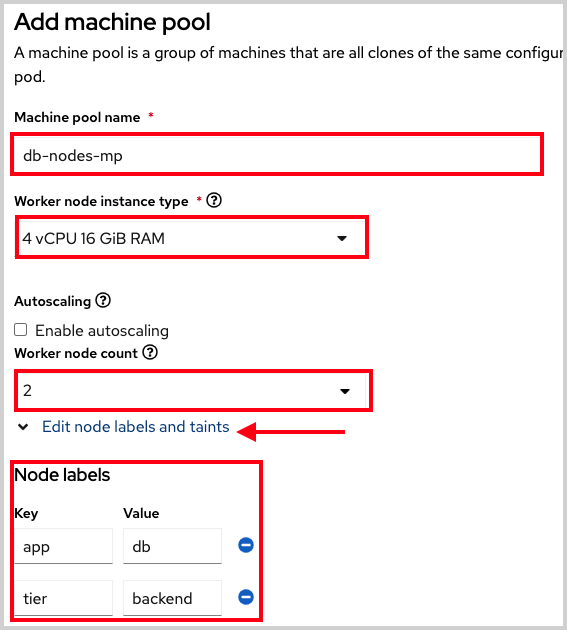
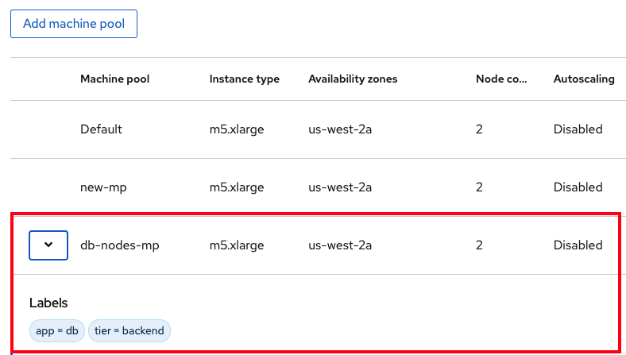
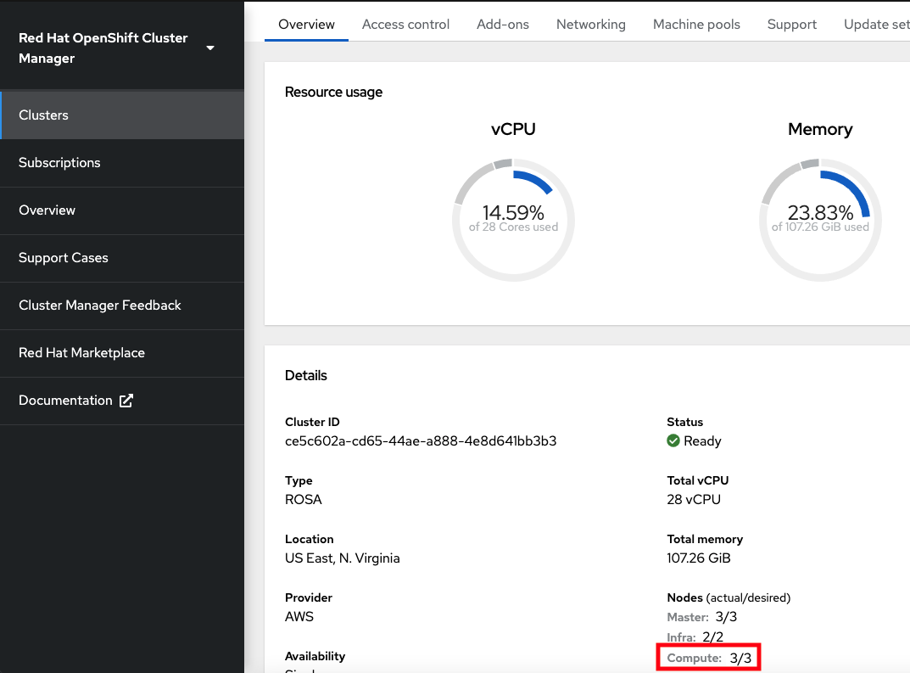

## Managing Worker Nodes

When using your cluster there may be times when you need to change aspects of your worker nodes. Things like scaling, changing the type, adding labels or taints to name a few. Most of these things are done through the use of machine pools in ROSA. Think of a machine pool as a “template” for the kinds of machines that make up the worker nodes of your cluster. A machine pool allows users to manage many machines as a single entity. Every ROSA cluster has a "Default" machine pool created when the cluster is created. If you'd like to learn more see [About machine pools and autoscaling](https://docs.openshift.com/rosa/nodes/nodes/nodes-machinepools-autoscaling-about.html).

#### Creating a Machine pool (CLI)
This can be accomplished though the `rosa` CLI or through the [OCM](https://console.redhat.com/openshift)  UI.

1. If using the CLI run:

        rosa create machinepool --cluster=<cluster-name> --name=<machinepool-name> --replicas=<number-nodes>

    For example:

        $ rosa create machinepool --cluster=my-rosa-cluster --name=new-mp --replicas=2
        I: Machine pool 'new-mp' created successfully on cluster 'my-rosa-cluster'
        I: To view all machine pools, run 'rosa list machinepools -c my-rosa-cluster'

1. Sometimes it is beneficial to add node label(s) and/or taints. One use case is to target certain workloads to specific nodes. Let’s say we want to run our database on specific nodes. We can add node labels to the worker nodes when we create a new machine pool using the CLI.

        rosa create machinepool --cluster=<cluster-name> --name=<machinepool-name> --replicas=<number-nodes> --labels=’<key=pair>’

    For example:

        $ rosa create machinepool --cluster=my-rosa-cluster --name=db-nodes-mp --replicas=2 --labels='app=db','tier=backend'
        I: Machine pool 'db-nodes-mp' created successfully on cluster 'my-rosa-cluster'

    This will create an additional 2 nodes that can be managed as one unit and also assign them the labels shown.  

1. Now run the following to see the new machine pool created along with the labels we gave.

        rosa list machinepools --cluster=<cluster-name>

    You will see a list of the machine pools like this:

        ID           AUTOSCALING  REPLICAS  INSTANCE TYPE  LABELS                  TAINTS    AVAILABILITY ZONES    
        Default      No           2         m5.xlarge                                        us-east-1a            
        new-mp       No           2         m5.xlarge                                        us-east-1a             
        db-nodes-mp  No           2         m5.xlarge      app=db, tier=backend              us-east-1a             

#### Creating a Machine pool (UI)
1. This can also be achieved through the [OCM](https://console.redhat.com/openshift) UI. Click on your cluster.

    

1. Then click on the "Machine Pools" tab.

    

1. Click the "Add Machine pool" button.

1. Fill in the desired configuration. At this point you can also and expand the "Edit node labels and taints" section to add node lables and taints to the nodes in this machine pool.

    

1. You will now see the new machine pool you created in the UI

    

#### Scaling worker nodes

1. To scale the number of worker nodes we need to edit the machine pool they belong to. The default machine pool is called “Default” which is created with every cluster. We could also use the one we created before.

1. We should see the “Default” pool that is created with each cluster.

        rosa list machinepools --cluster=<cluster-name>

    You will see a response like:

        ID          AUTOSCALING  REPLICAS  INSTANCE TYPE  LABELS            TAINTS    AVAILABILITY ZONES
        Default     No           2         m5.xlarge                                  us-east-1a

1. To scale this out to 3 nodes run

        rosa edit machinepool --cluster=<cluster-name> --replicas=<number-nodes> <machinepool-name>

    For example:

        rosa edit machinepool --cluster=my-rosa-cluster --replicas 3 Default

1. Run the following to see that it has taken effect

        rosa describe cluster --cluster=<cluster-name> | grep Compute

    You will see a response showing 3 compute nodes:

        $ rosa describe cluster --cluster=my-rosa-cluster | grep Compute

        - Compute:                 3 (m5.xlarge)

1. (Optional) One can also scale the cluster from the OCM UI by clicking on the "three dots" on the right of the machine pool you want to edit and clicking "scale".

    

1. We can also confirm this by accessing OCM and selecting the cluster.

1. On the overview tab, scroll down to the middle section under details you will see Compute listing "3/3".

    

#### Adding node labels

>**NOTE:** Labels or taints cannot be added to the "Default" machine pool (yet).

1. Adding node label(s) can be achieved by the following command

        rosa edit machinepool --cluster=<cluster-name> --replicas=<number-nodes> --labels='key=value' <machinepool-name>

    For example if we wanted to add 2 labels to the new machine pool we created:

        rosa edit machinepool --cluster=my-rosa-cluster --replicas=2 --labels 'foo=bar','baz=one' new-mp

1. This command replaces all machine pool configurations with what is defined.  So if you just want to add another label and keep the old, you must state all the labels otherwise it will replace anything existing with the one you had wanted to add. By the same token if you want to delete a label just state the ones you want, excluding the one you want to delete.

    >**NOTE:** Currently, adding node labels on an existing machine pool adds the labels to only new nodes that are created in that pool. The existing nodes will not have the node label applied. If you need nodes with the node label, you can either scale down the nodes in the machine pool to zero (this will not work with the 'default' machine pool), add the node label, and then scale back up to the desired amount. You can also create a new machine pool and define the node labels at creation time.

#### Mixing different node types

1. You can also mix different worker node machine types in the same cluster by using new machine pools. You cannot change the node type of a machine pool once created, but we can create a new machine pool with different nodes by adding the `--instance-type` flag.
1. If we take the use case above (database nodes) but instead wanted to have a different node type when creating it, we would have ran

        rosa create machinepool --cluster=<cluster-name> --name=<mp-name> --replicas=<number-nodes> --labels=’<key=pair>’ --instance-type=<type>

	For example:

        rosa create machinepool --cluster=my-rosa-cluster --name=db-nodes-large-mp --replicas=2 --labels='app=db','tier=backend' --instance-type=m5.2xlarge

1. If you’d like to see all the [instance types available](https://docs.openshift.com/rosa/rosa_policy/rosa-service-definition.html#rosa-sdpolicy-aws-compute-types_rosa-service-definition) you can run:

        rosa list instance-types

1. Or to make the decisions step-by-step, then use the `--interactive` flag:

        rosa create machinepool -c <cluster-name> --interactive

    

1. List the machine pools to see the new larger instance type

        rosa list machinepools -c <cluster-name>

    

*[ROSA]: Red Hat OpenShift Service on AWS
*[IdP]: Identity Provider
*[OCM]: OpenShift Cluster Manager
